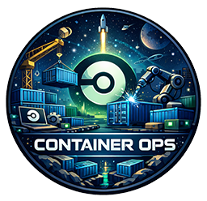

  
  <h1>Container Ops Orb</h1>
  <i>A CircleCI orb that simplifies building, signing, scanning, and publishing container images.</i>  

   

## Getting Started
The goal of this orb is to share jobs that allow users to easily perform the following operations:
- Create container image using `docker`, or distroless container images using `apko` and `melange`.
- Sign the container images using `cosign`.
- Publish the container images to a container registry such as `ghcr.io`.
- Scan the contents of container images using `syft` to produce SBOMs.
- Scan the container images for vulnerabilities using `grype`.
- Publish the signature and attach SBOMs and/or scan results as attestations.
